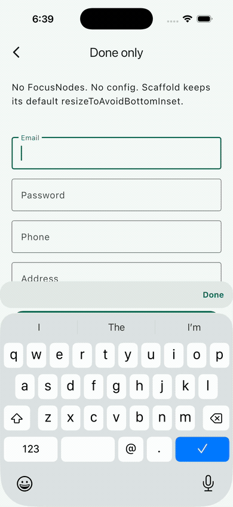
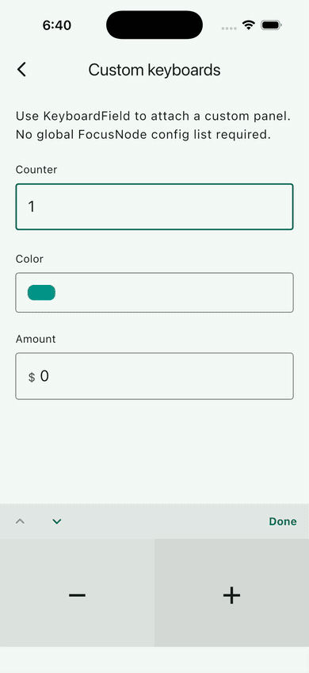
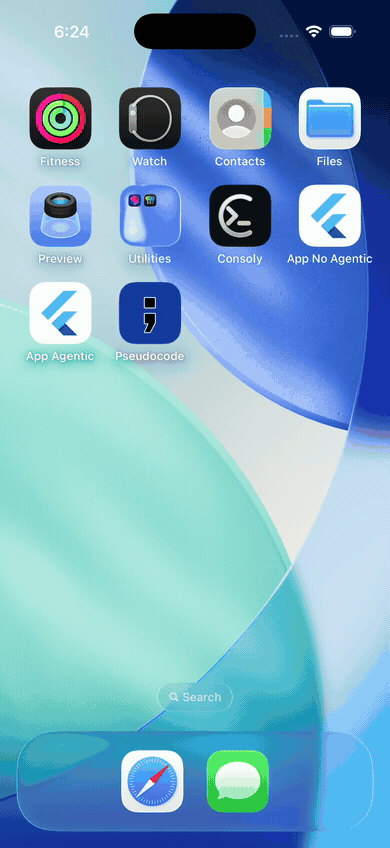
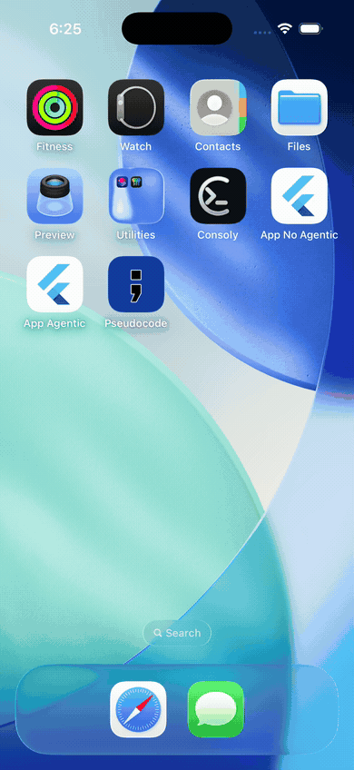

# Keyboard Actions 5

The easiest way to create a **professional keyboard experience** in Flutter.

Done · Previous / Next · Custom toolbars · Custom keyboards  
Works with **ListView, forms, dialogs, bottom sheets, and slivers**, without scroll hacks.

**Start with the example app.** The [`example/`](example/) project is a runnable gallery with every feature. Clone the repo, run `cd example && flutter run`, and open each demo to see real-world usage before wiring it into your app.

## Preview

| Done only | Navigation |
|:---:|:---:|
|  |  |

| Custom keyboard | Integrated bar |
|:---:|:---:|
|  |  |

| Large ListView | Dialog |
|:---:|:---:|
|  |  |

Record or refresh clips with `./tool/record_readme_gifs.sh <name> 5` while the matching example demo is open. See [`doc/gifs/README.md`](doc/gifs/README.md).

---

## Install

```yaml
dependencies:
  keyboard_actions: ^5.0.0
```

Keep Flutter's default:

```dart
Scaffold(
  // resizeToAvoidBottomInset: true  ← leave the default
  body: KeyboardActions(child: ...),
)
```

---

## How it avoids the usual keyboard bugs

Most keyboard packages wrap your tree in custom padding / `SingleChildScrollView`. That breaks nested scrollables, slivers, and sheets.

**Keyboard Actions 5 does not hijack scrolling.**

1. Draws a floating toolbar in an `Overlay`
2. Reserves the toolbar/footer height at the bottom of its child, so the focused field always has room to clear the bar no matter where you wrap
3. Inflates `MediaQuery.viewInsets` by the same amount, so a nested Scaffold / Dialog / BottomSheet reacts naturally
4. Scrolls the focused field into view when it would be covered by the keyboard or bar

---

## Quick start

### Done only

```dart
Scaffold(
  body: KeyboardActions.done(
    child: ListView(
      padding: const EdgeInsets.all(20),
      children: const [
        TextField(decoration: InputDecoration(labelText: 'Email')),
        TextField(decoration: InputDecoration(labelText: 'Password'), obscureText: true),
      ],
    ),
  ),
)
```

### One field only

Same widget, wrapped tighter. There is no separate API for a single field:

```dart
KeyboardActions.done(
  child: TextField(
    keyboardType: TextInputType.phone,
    decoration: InputDecoration(labelText: 'Phone'),
  ),
)
```

### Where to wrap: anywhere

Wrap the `Scaffold` body, a `ListView`, a `Form`, or one `TextField`. Put it
inside a scrollable or around it. The focused field clears the bar either way,
because `KeyboardActions` reserves the toolbar height at the bottom of its
child: inside a scrollable that becomes extra scroll extent, around one it
shrinks the viewport by exactly the pixels the bar covers.

So there is nothing to decide, and no extra widget to learn.

---

### Prev / Next / Done (default)

```dart
KeyboardActions(
  submitText: 'Submit',
  onSubmit: () { /* last field */ },
  child: Form(
    child: ListView(
      children: const [
        TextField(decoration: InputDecoration(labelText: 'Name')),
        TextField(decoration: InputDecoration(labelText: 'Email')),
        TextField(decoration: InputDecoration(labelText: 'Notes'), maxLines: 3),
      ],
    ),
  ),
)
```

No `FocusNode`s. No config object. Fields are discovered automatically.

### The three callbacks

Each one answers a different question, so none of them overlap:

| | Fires when | Use for |
|---|---|---|
| `KeyboardActions.onDismissed` | the keyboard closes, **any** way: Done or a dismissing tap outside | "the user finished with this field" |
| `KeyboardActions.onSubmit` | Submit is pressed on the last field | the form action: send, search, log in |
| `KeyboardField.onDone` | *this* field's Done is pressed | per-field cleanup; runs before `onDismissed` |

Submit needs `onSubmit` to appear, and it replaces Done on the last field.
Without it you get Done everywhere.

---

## Per-field customization: `KeyboardField`

Use inside a [KeyboardActions] ancestor for per-field overrides. That ancestor
can wrap just this field:
`KeyboardActions.done(child: KeyboardField(footer: pad, child: ...))`.

Configure a field **next to the widget**, not in a global list. See [`example/lib/pages/custom_keyboard_page.dart`](example/lib/pages/custom_keyboard_page.dart) for a full custom-keyboard setup.

```dart
KeyboardField(
  toolbarButtons: [
    (node) => IconButton(
          icon: const Icon(Icons.keyboard_hide),
          onPressed: node.unfocus,
        ),
  ],
  child: const TextField(
    decoration: InputDecoration(labelText: 'Email'),
  ),
)
```

### Custom keyboard panel

```dart
KeyboardField(
  showBar: false, // panel has its own Done
  footer: NumericKeyboard(
    notifier: amount,
    onDone: () => focus.unfocus(),
  ),
  child: KeyboardCustomInput<String>(
    focusNode: focus,
    notifier: amount,
    builder: (context, value, hasFocus) => Text(value),
  ),
)
```

Per-field options: `showBar`, `showArrows`, `showDone`, `toolbarButtons`, `footer` / `footerBuilder`, `onDone`, optional `focusNode`.

---

## Toolbar styling: `KeyboardActionsThemeData`

All appearance lives in one object, so you style the bar once for the whole app instead of repeating parameters. See [`example/lib/pages/theming_page.dart`](example/lib/pages/theming_page.dart), which switches presets live.

Wrap your app to style every bar in it:

```dart
KeyboardActionsTheme(
  data: KeyboardActionsThemeData(
    barColor: const Color(0xFF1B4D3E),
    foregroundColor: Colors.white,
    doneText: 'Listo',
    doneTextStyle: const TextStyle(fontWeight: FontWeight.w800, fontSize: 17),
  ),
  child: MaterialApp(...),
)
```

It is also a `ThemeExtension`, so you can keep it inside your `ThemeData` and get light/dark handling for free:

```dart
MaterialApp(
  theme: ThemeData(
    extensions: const [
      KeyboardActionsThemeData(barColor: Color(0xFFEEEEEE)),
    ],
  ),
)
```

Or override a single instance:

```dart
KeyboardActions(
  theme: const KeyboardActionsThemeData(barHeight: 62),
  child: ...,
)
```

Resolution order: `KeyboardActions.theme` → `KeyboardActionsTheme` → `ThemeData.extensions` → Material / platform defaults. Unset values fall through, so a per-screen override only replaces what it sets.

### Theme options

| Option | Default | Description |
|---|---|---|
| `barColor` | Material surface | Bar background |
| `foregroundColor` | `colorScheme.primary` | Arrows and label color |
| `disabledColor` | `theme.disabledColor` | Arrows at the first / last field |
| `barHeight` | `46` | Bar height |
| `elevation` | `0` (M3) / `12` (M2) | Material elevation |
| `borderRadius` | pill on iOS 26+ | Corner radius |
| `keyboardGap` | `8` on iOS 26+, else `0` | Space between bar and keyboard |
| `padding` | `horizontal: 2` | Padding around bar content |
| `doneTextStyle` | bold, `foregroundColor` | Done label style |
| `submitTextStyle` | w600, `foregroundColor` | Submit label style |
| `previousIcon` / `nextIcon` | chevrons | Custom arrow icons |
| `doneText` | `'Done'` | Done label, set here to localize app-wide |
| `submitText` | `'Submit'` | Submit label |
| `integratedBar` | `false` | Flush bar against the keyboard |

Text styles are **merged** over the defaults, so `doneTextStyle: TextStyle(fontSize: 20)` changes the size and keeps the resolved color.

### iOS 26 and `integratedBar`

On **iOS 26+** the bar floats above the system keyboard with a small gap and rounded corners, matching the new keyboard shape. On older iOS and Android it sits flush by default.

Set `integratedBar: true` for a classic accessory toolbar that is always flush with the keyboard, with no gap and no rounded corners. See [`example/lib/pages/integrated_bar_page.dart`](example/lib/pages/integrated_bar_page.dart).

```dart
KeyboardActions(
  theme: const KeyboardActionsThemeData(integratedBar: true),
  child: ...,
)
```

---

## API overview

That is the whole public API, and the first three cover almost everything.

| API | Purpose |
|---|---|
| `KeyboardActions` | The wrapper: navigation, Done/Submit, reserved space, overlay bar |
| `KeyboardActions.done` | Shortcut: Done only, no Prev/Next |
| `KeyboardField` | Local per-field overrides + custom footer |
| `KeyboardActionsThemeData` | All bar appearance in one object |
| `KeyboardActionsTheme` | Applies theme data to a subtree |
| `KeyboardCustomInput` | Focusable value display for custom keyboards |
| `KeyboardCustomPanelMixin` | Helper mixin for custom panel widgets |
| `KeyboardNavigation.none / .auto` | Arrows off / on when 2+ fields |

### `KeyboardActions` options

Behavior lives on the widget; appearance lives in the theme.

| Option | Default | Description |
|---|---|---|
| `navigation` | `auto` | Prev/Next arrows when 2+ fields |
| `ensureVisible` | `true` | Scroll focused field above keyboard + bar |
| `ensureVisibleAlignment` | `0.15` | Target alignment when scrolling |
| `dismissOnTapOutside` | `true` | Unfocus on a tap outside the field/bar (scrolls don't dismiss) |
| `doneText` | theme, then `'Done'` | Done button label for this instance |
| `submitText` | theme, then `'Submit'` | Submit label, replaces Done on the last field |
| `onSubmit` | `null` | Required for Submit to appear on the last field |
| `onDismissed` | `null` | Called whenever the keyboard closes (Done or tap outside) |
| `theme` | `null` | Appearance overrides for this instance |
| `enabled` | `null` (iOS + Android) | `null` = auto, `true` = always, `false` = never |

```dart
KeyboardActions(
  navigation: KeyboardNavigation.auto,
  ensureVisible: true,
  dismissOnTapOutside: true,
  submitText: 'Submit',
  onSubmit: () {},
  theme: KeyboardActionsThemeData(
    barColor: Colors.grey.shade200,
    doneTextStyle: const TextStyle(color: Colors.green),
  ),
  child: ...,
)
```

---

## Example gallery

The best way to learn the package is to run the example project and tap through every screen:

```bash
git clone https://github.com/diegoveloper/flutter_keyboard_actions.git
cd flutter_keyboard_actions/example
flutter run
```

Each demo lives under [`example/lib/pages/`](example/lib/pages/):

| Demo | What it shows | Preview |
|---|---|---|
| **Done only** | Zero config login-style form |  |
| **Form + navigation** | Prev / Next / Done / Submit |  |
| **Theming** | Colors, height, labels and icons via theme | |
| **Integrated bar** | `integratedBar: true`, flush toolbar |  |
| **Material 2** | Classic M2 theme + integrated bar | |
| **Large ListView** | 40+ fields, no scroll wrapper hacks |  |
| **Custom keyboards** | Counter, color picker, numeric panels |  |
| **Dialog** | Works inside `AlertDialog` |  |
| **Bottom sheet** | Checkout-style modal sheet | |
| **Nested scroll** | `CustomScrollView` + slivers | |

Custom keyboard widgets are in [`example/lib/widgets/custom_keyboards.dart`](example/lib/widgets/custom_keyboards.dart).

---

## Migration from 4.x

| Old | New |
|---|---|
| `KeyboardActionsConfig` + FocusNode lists | Usually unnecessary: auto discovery |
| `BottomAreaAvoider` / `autoScroll` padding | Removed: reserved space + scroll correction |
| `resizeToAvoidBottomInset: false` | Keep Flutter default (`true`) |
| `KeyboardActions.simple` / `.auto` | `KeyboardActions.done` / `KeyboardActions(...)` |
| Global `actions: [KeyboardActionsItem(...)]` | Local `KeyboardField(...)` |
| `keyboardBarColor` / `keyboardBarElevation` | `KeyboardActionsThemeData` |
| `nextIcon` / `previousIcon` on config | `KeyboardActionsThemeData` |

---

## License

MIT
